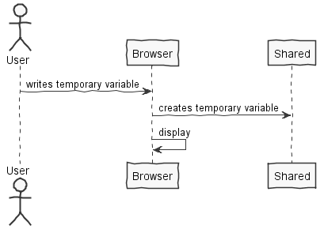
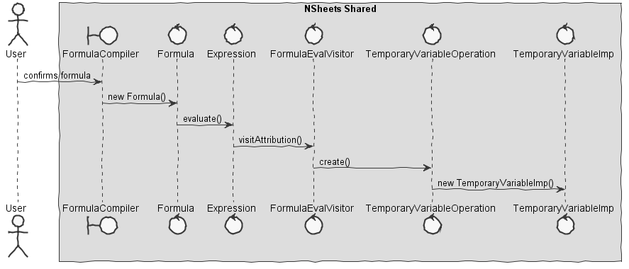

**Marco Ferreira** (1161025) - Sprint 3 - Lang02.1
===============================

# 1. General Notes

I decided to stick with this implementation because it had not been finished in the previous sprint and also because other Uc's depended on the temporary variables. I found this feature very difficult and I could not finish it. The only thing I was able to do was assign a value to the temporary variable.

# 2. Requirements

Lang02.1 - Temporary Variables:
*Add support for temporary variables. The name of temporary variables must start with the "_" sign. When a variable is referred in a formula for the first time, it is created. To set the value of a variable it must be used on the left of the assign operator (":="). Temporary variables are variables that only exist in the context of the execution of a formula. Therefore, it is possible for several formulas to use temporary variables with the same name and they will be different instances. Example: "= {_Counter:=1; WhileDo(Eval( "A"&_Counter)> 0; {C1:=C1+Eval("B"&_Counter); _Counter:=_Counter+1 }) }” . In this example, the cell C1 will get the sum of all the values of column B in that the corresponding values in column A are greater than zero.*

Proposal:

- US1 - As an User I want to be able to create temporary variables and use them in the formula.

# 3. Analysis

## 3.1 Analysis Diagrams

**Use Cases**

- **Use Cases**. Since these use cases have a one-to-one correspondence with the User Stories we do not add here more detailed use case descriptions. We find that these use cases are very simple and may eventually add more specification at a later stage if necessary.

**System Sequence Diagrams**

**For US1**

# 4. Design
## 4.1. Requirements Realization

**For US1**

# 5. Work Log

Commits:

- [[#52] temp var now receive initial value](https://bitbucket.org/lei-isep/lapr4-18-2dc/commits/67f1ab2484a2cc6686b390876c8b67e4530fc1bb)
- [[#52] remove unnecessary methods](https://bitbucket.org/lei-isep/lapr4-18-2dc/commits/ab10ec0e2d28c72eea61cbce7ba802ef029976f2)
