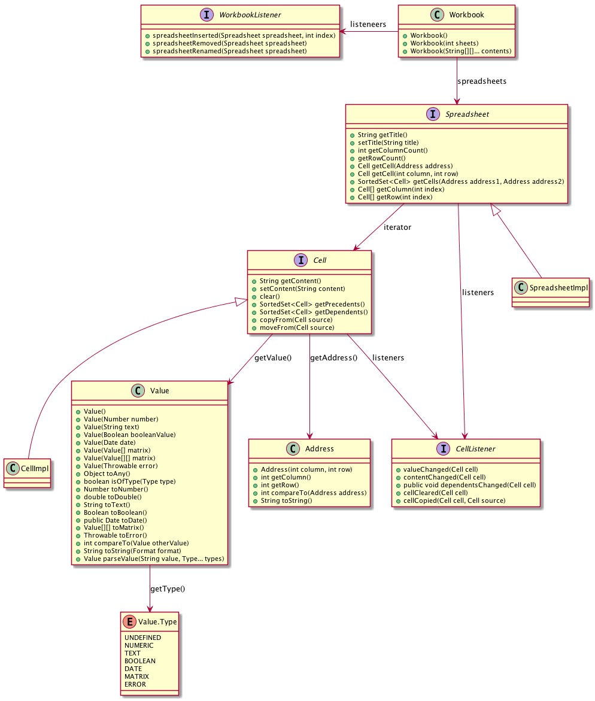
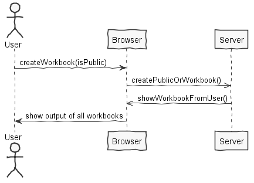
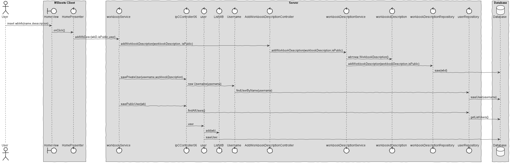
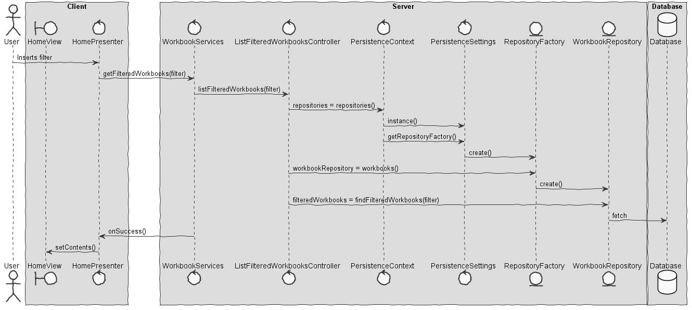

**Pedro Almeida** (1161027) - Sprint 2 - Core06.2:  Private Workbooks
===============================
# 1. General Notes

My feature is **implemented** and **fully functional**.
Despite the fact that my feature depended on others - Like Core01.1,I managed to complete it.
The way that i save the workbooks is not the best because in the previous iteration that use case wasn´t functional and by the time that use case was fixed it was to late for me to change all the structure behind it.

I Had to redo alot of a my work because of git reverts, some links to my works may not be in the current MASTER-BRANCH.

# 2. Requirements

*In this section is described the requirements for this sprint.*

  * IPC06.2 - Private Workbooks:

  Workbooks that are created by the user should be considered private. The "Home" page should now be able to display private and public workbooks. It should be possible to apply filters to this view/page to display only private or public workbooks with specific names or descriptions (the application should accepted regular expressions to filter the workbooks). Public and private workbooks should have some visual distinction (e.g, icon).

#### Proposal:

###### USER STORIES:

- *Private Workbooks*

  - US1 - As default User I want to have the option to create public and private workbooks. All the users can see the public workbooks, but the private are only saw by the user that created it.

  - US2 - As a default user I want to filter the users workbooks,both public and private, and see the only the private workbooks or the public workbooks.

# 3. Analysis

*In this section is described the study/analysis/research I developed in order to design a possible solution.*

For this feature increment, since it is the first one to be developed in a new project I need to:  

-Understand how the workbook is persisted on the database.

-Understand what was done in the first iteration and see if i can improve it.

-Understand all the implications that the worbook has on the program itself.

#### 3.1 - Understand the problem itself

##### 3.1.1 The features

  IPC06.2 - There will be 2 buttons on the home page. Each button will able the user to create a private or a public workbook. When a workbook is created, the user is informed about the success of the operation. If the user has created a public workbook, all the useres that are authenticated in the system will be able to see that same workbok that one user create. If the workbook is private, only the user that created the workbook is able to see it and change it.

  IPC06.2 - There is also the option to filter the user´s workbook. If the users wants to see only his private workbooks or his public ones, he should be able to do it with any problems.

##### 3.1.2 The main idea behind it.

- *The main idea behind the program*

- *Create Public or Private Workbooks*

- *Filter private or public workbooks*

#### 3.2 Undersatnd how the UI is implemented.

###### 3.2.1 APPLICATION UI

# 4. Design

*In this is presented the design solution for the requirements of this sprint.*

- *Create Public or Private Workbooks*

- *Filter private or public workbooks*

## 4.1. Tests

*In this section is should described the design of the tests that, as much as possibe, cover the requirements of the sprint.*
 
All my methods are tested in the UI because I didn´t have any major domain related testes.
The major methods that i used were already tested in UC core01.1.

## 4.4. Design Patterns and Best Practices

*Present and explain how you applied design patterns and best practices.*

- Service: it was used for the client-server comunication.

- DTO: it was used for the client, server comunication.

- Singleton: the singleton was used to get the current workbook.

- Layer

- MVC

# 5. Work Log

*Here is a log of my daily work, not all of them are related to my issue - some were to help friends. It only references my relevant commits. I made others to fix mainly bugs and maven erros.*

### **Relevant** Commits:

[Issue#41]-analysis(https://bitbucket.org/lei-isep/lapr4-18-2dc/commits/c604465c7acd6b7757c1f0b9cf03a3a1ddce2a5c)
[Issue#41]-design(https://bitbucket.org/lei-isep/lapr4-18-2dc/commits/c604465c7acd6b7757c1f0b9cf03a3a1ddce2a5c)
[Issue#41]-now workbooks can be public and privvate(https://bitbucket.org/lei-isep/lapr4-18-2dc/commits/c604465c7acd6b7757c1f0b9cf03a3a1ddce2a5c)
[Issue#41]-UI option to create public and private workbooks(https://bitbucket.org/lei-isep/lapr4-18-2dc/commits/c604465c7acd6b7757c1f0b9cf03a3a1ddce2a5c)
[Issue#41]-create public workbook code(https://bitbucket.org/lei-isep/lapr4-18-2dc/commits/c604465c7acd6b7757c1f0b9cf03a3a1ddce2a5c)
[Issue#41]-create private workbook code(https://bitbucket.org/lei-isep/lapr4-18-2dc/commits/c604465c7acd6b7757c1f0b9cf03a3a1ddce2a5c)
[Issue#41]-the public workbook is seen by all users, the private is only seen by the user that created it(https://bitbucket.org/lei-isep/lapr4-18-2dc/commits/c604465c7acd6b7757c1f0b9cf03a3a1ddce2a5c)
[Issue#41-UI refinements](https://bitbucket.org/lei-isep/lapr4-18-2dc/commits/c604465c7acd6b7757c1f0b9cf03a3a1ddce2a5c)