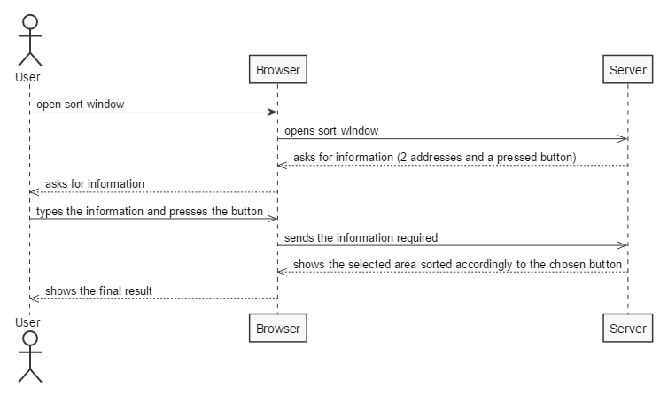
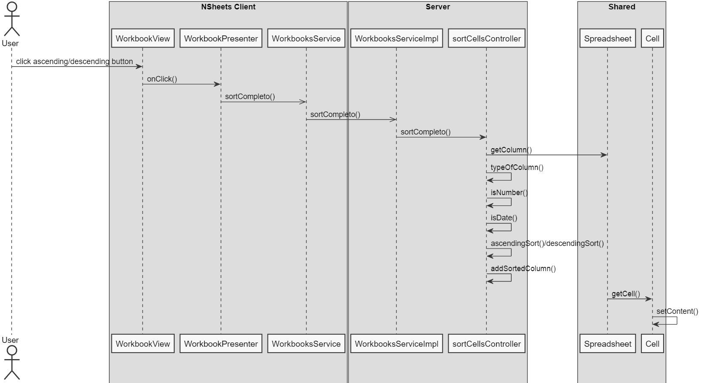

**Simão Sousa** (1161032) - Sprint 1 - CORE3.1
===============================

# 1. General Notes

*In general i tried my best to fully implement my use case, but i had some difficulties related to the usage of the GWT framework, and to the fact that i relied on the work of some colleagues that was not fully functional, which led me to keeping my code comented out until everything was implemented, which did not occur. *

# 2. Requirements

Core03.1 - Sort Range of Cells :
*Sort a range of cells. A range of cells is a rectangular area delimited by an upper left corner and a lower right corner. The sorting is based on one or more columns of the range. It should be possible to select the order: ascending or descending. Interaction with the user should be based on a popup menu. It should be possible to sort data of the following types: numeric, text or date.*

# 3. Analysis

Being this sprint the first contact we had with the project, we mainly needed to focus on:

- Understanding how the application worked and how the classes were conected among themselves  

- Understanding and learning about the GWT framework and its implications in the way the project needed to be coded, practising on how to implement controllers and ui's since they can't communicate directly

## 3.1 Analysis Diagrams

- **Sort Range of Cells** This use case is pretty straightforward. The user will have an icon on the workbook tab, that when pressed will ask him to select 2 cell addresses and the type of sorting he wants for the area delimited by those addresses, ascending or descending. On button pressing, the cells will be sorted accordingly.

# 4. Design

## 4.1 Sequence Diagram

# 5. Implementation

*Basically this use case required the user to select two addresses in order to use them to select an area of cells to sort. These cells were contained in a spreadsheet though, which was inside of a workbook, and without the means to get the active workbook there was no way this could be properly achieved. The best way i thought of to counter the problem was to create a SpreadsheetDTO with a map of AddressDTO's and CellDTO's, converting the spreadsheet into a DTO to pass it on to the services class, and transforming it again into the spreadsheet core class to be used by the controller. The problem with this approach and the why i decided not to take it in the end was because by altering the Spreadsheet into a DTO and making it back into a Spreadsheet, although it would change its contents, it would not be sorting the spreadsheet itself, but instead a copy of it, which was not what the use case intended. For its utmost correctiveness, we need to be able to get the active workbook and its spreadsheets and work with those.*

# 6. Final Remarks

*As stated previously, this use case was pretty much ready to be implemented, but still waiting for one's ability to select the active workbook, allowing to select a spreadsheet to sort the cells in.*

# 7. Work Log

Commits:
[[#7] Added Documentation](https://bitbucket.org/lei-isep/lapr4-18-2dc/commits/d4918e3ea5a46a4ba485ebceebef1d983a6beebf)

[[#7] Created Sort Class](https://bitbucket.org/lei-isep/lapr4-18-2dc/commits/ab1eb4324852d5d0e41c273b05121e814e6c5ec2)

[[#7] Deleted sort class and updated SortCellsController](https://bitbucket.org/lei-isep/lapr4-18-2dc/commits/5ca215b4ab2b2023815cfc690b8f8d8b90db1171)

[[#7] Updated documentation and started UI related to Core 03.1 ](https://bitbucket.org/lei-isep/lapr4-18-2dc/commits/32fa68813ec427dd14bcb4deb53a66442da60709)

[[#7] Minor UI changes, updated WorkbookService but not yet implemented ](https://bitbucket.org/lei-isep/lapr4-18-2dc/commits/844ff68271af2bdad5406749a38bc327f96a69c5)

[[#7] Minor updates to services and UI ](https://bitbucket.org/lei-isep/lapr4-18-2dc/commits/1947ca7aa59bb5300e5b9317846a107f18e9dcd7)
