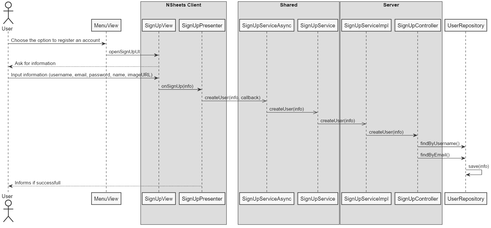

**Simão Sousa** (1161032) - Sprint 2 - IPC01.2
===============================

# 1. General Notes

*This iteration i somewhat noticed a few more problems related to git version control, with a lot more merges causing big conflicts leading to heavy reverts which most times caused some harm. Another thing i should point out was that yet again i was dependant on other colleagues, this time on the one that was responsible about the previous iteration of this UC. On the contrary to my last iteration one though, he provided very solid foundations for me to work, and helped me whenever needed.*

# 2. Requirements

The application should add the possibility of registering new users. The identification of a user should be based on his email. Each user should have an email, name, nickname and picture (i.e., face photo). The application should display the nickname and photo of the authenticated user in the top of every page.

# 3. Analysis

*The use case was, as i said before, relying on some pretty solid foundations, with the previous iteration making it simple for me to build upon and change when needed.*
*The biggest challenge i found, which for me was really really hard to overcome, was for the user to upload an image to be his profile photo, since there is a big lack of information regarding gwt upload of files, which made me lose a lot of time researching, adn testing through experience itself.*

## 3.1 Analysis Diagrams

# 4. Design

## 4.1 Sequence Diagram

## 4.1. Tests

*Since my use case was majorly UI related, most of the tests i performed were functional tests and not unit tests.*
*Below are some examples of them, such as:*
*A user not being able to create an account if information is missing on his signUp*

*A user not being able to register if there is already a user with the same email or username*

*A user not being able to register if the email formatting is not correct, with it being 'something@something.something'*

## 4.2. Design Patterns and Best Practices

In this use case i applied the following design patterns:  
- Singleton  
- Repository  
- MVP
- DTO

# 5. Implementation

*In this use case, the user had to have to possibility to create an account. These accounts were previously hardcoded into the program, but they now had to be created and persisted in the database. The account creation had to manage the GWT gatekeeper functionality as well, since a user should obviously be able to signUp without having an account logged in. The sign up process validates the following: a user cannot create an account if the username is already in use; a user cannot create an account if the email is already in use; a user cannot create an account if there is missing information on the signUp process; a user cannot create an account if the email field doesn't have the correct formatting 'something@something.something'. It also had to show the user picture and the user's username on the top of the screen, where i also made the signUp and Login options not visible when the user is logged in. *

# 6. Integration/Demonstration

*As said in the general notes, this iteration i noticed a lot more problems related to git version control, which besides other things made everyone waste a lot of time, and both I and a lot of colleagues worked pretty hard to correct most of the conflicts on the program without the need to revert commits to earlier stages of the program, losing valuable information, but it was still not always possible.*

# 7. Final Remarks

*In my opinion, the most important thing i have to say is that i am happy to have overcome the difficulty associated to the upload of images from the users part, since it was definitely where i lost most of my time and effort, and it felt really damn nice when it finally worked out. *

# 8. Work Log

Commits:

Documentation update on IPC01.2 

Implementation update on IPC01.2, added User Interface, functions not implemented, minor changes to gatekeeper functionality

Updates to UI and service created 

User can already sign up and it is saved on the database 

Minor updates to validations related to the UI 

Updates related to UI and validations, only missing the image 

Updated Documentation 

Updated Documentation and minor validations implemented

Final touch of implementation, plus some documentation added 

Documentation finalized, use case resolved