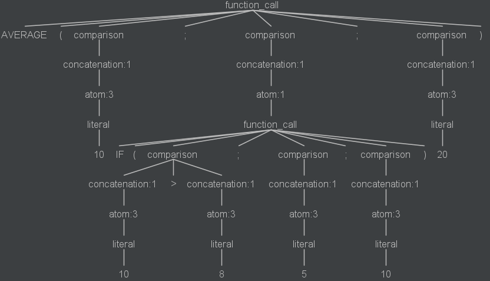

**Simão Sousa** (1161032) - Sprint 3
===============================

# 1. General Notes

Since this use case was assigned to me I have found it a little bit counterproductive. This due to the fact that the use case implemented at the second iteration was a lot more coherent and would function beter overall due to the validations associated with it. Now, since i had to give the user total liberty to alter the cell text, it is more prone to problems tham before, btu i think it was successfully implemented.

# 2. Requirements

The wizard should now have an edit box where the formula is gradually constructed. The user should be able to edit the formula text freely. The functions or operators (and the values of its parameters/operands) selected from the list should now be inserted in the position of the cursor in the new edit box. The wizard should continue to have an area to display the evaluation of the formula (that should be produced dynamically, as the user edits the formula). The wizard should also have a new window that should display the structure of the formula expression like an abstract syntax tree (i.e., the structure resulting from the formula compilation). When the user clicks a tree element its respective text in the edit box should appear highlighted.

# 3. Analysis

This time, i think this iteration had two main parts, the one that had to allow the user to freely edit the text box that would contain the formula on the wizard, and the one that had to allow the user to create an abstract syntax tree and highlight the parts of the tree related to the hovered part of the function.
I was only able to implement the first part, because of the total lack of knowledge regarding how to create and transfer an ast from java to gwt and use the correct interface to deliver the fully functional highlighter methods.

# 4. Design

I was also able to create some of the abstract syntax trees as required, but i was never able to get them into the gwt interface where the user could interact with them, and here is an example of an ast with functions within functions:

Using the function:

it would create the following abstract syntax tree that should be shown within a new window in the interface:

# 5. Implementation

The main problems i found in this use case were 2 particular ones. One as i mentioned earlier was just kind of psychological, and it was the fact that i felt like i was going back in terms of program quality by allowing the user to fully alter the functions since they were already standardized and correct overall. The second biggest problem was with the abstract syntax trees. I was able to create abstract syntax trees using different plugins, but what they returned were images of the said trees, and these images could not be used due to the other requirement, the fact that by hovering over a certain element in the tree, it should be highlighted in the formula. This plus the fact that gwt has some major limitations with file trasnfer and usage led me to be unable to implement the second part of the use case.

# 6. Integration/Demonstration

My biggest contribution to the program in this iteration, as i already stated, was in my opinion a bit counter-productive. If the user knows what he is doing however, he is now able to fully edit the text box in the wizard window, allowing him to introduce functions within functions, to edit them in the wizard itself, or to just restart them as he wished. If he doesn't though, he can just enter random information which will not be recongnized by the grammars and the entered formula will be ignored.
