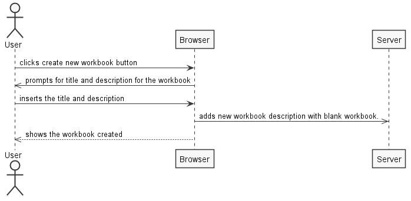
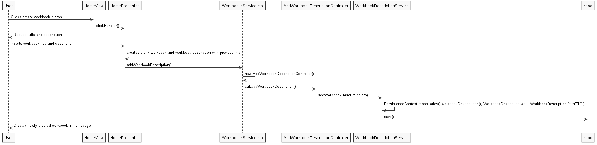

**Vitor Brito** (1161182) - Sprint 1 - Core01.1
===============================

# 1. General Notes

*In this section you should register important notes regarding your work during the sprint. For instance, if you spend significant time helping a colleague or if you work in more than one feature increment.*

Difficulties were faced due to GWT since it was a completely new framework, mostly the way it forces the program to be structured revealed to be rather confusing at times.

# 2. Requirements

    Core01.1 - The workbook page should be related to one of the workbooks displayed in the home page. 
               It should be possible to create a new empty workbook in the home page. 
               Workbooks should be persisted in the server. 
               At this moment a workbook must only have one spreadsheet.

# 3. Analysis

*In this section you should describe the study/analysis/research you developed in order to design a solution.*

For this feature increment, since it is the first one to be developed in a new project I need to:  

    - Understand how the application works and also understand the key aspects of GWT, since it is the main technology behind the application  
    
    - Understand how the Home Page is implemented
    
    - Understand how to integrate a relational database into the project
    
##3.1 Analysis Diagram
**Create Workbook**  - Use case interacts with ui

# 4. Design

*In this section you should present the design solution for the requirements of this sprint.*

## 4.1 Sequence Diagram

# 5. Implementation

This use case can be divided into four simpler to understand parts.
    
    1.  The workbook page should be related to one of the workbooks presented in the homepage.
    
This part presented the hardest problem to overcome in this sprint. Having ran into problems understanding the general structure of the program ended up having a hard time understanding where to insert the necessary code to allow global access to the active workbook.

Tried to use a variable in each workbook to hold the information on which workbook was active, but it revealed to need too much power to keep updated. Got to the final understanding that would be best to have a static variable on a high level class (**Application**). This final experiment, per say, proved to be the best option at the time of finalizing the sprint.
    
    2.  It should be possible to create a new workbook from the homepage.
    
This feature presented mild confusion at first due to the way the project is structured. At first, i couldn't get how to associate the WorkbookDescription to the actual Workbook. Ended up giving the WorkbookDescription a reference to a workbook.

Feature runs without any problem. 

    3.  Workbooks should be persisted in the server.
    
Workbooks proved to be rather difficult to persist. Many times casing unknown problems and leading to many hours of work lost to nothing. through trial and error, mainly, but also some common wisdom it was possible to fully persist the workbook.
    
    4.  Must only have one spreadsheet 
    
Feature was implemented without any major problems.

**Code Organization**  

We followed the recommended organization for packages:  
- Code should be added (when possible) inside packages that identify the group, sprint, functional area and author;

# 6. Final Remarks 

Some problems remain unfixed. The biggets being that at the moment it is not possible to select and change the cell content on the workbook view.

# 7. Work Log

*Insert here a log of you daily work. This is in essence the log of your daily work. It should reference your commits as much as possible.*

Commits:

[Open #1 Documentation Directory for Core01.1](https://bitbucket.org/lei-isep/lapr4-18-2dc/commits/24b8abf955be85c75f2b97ac22ee722ac23e6c39)

[#1 Documentation Directory in Readme.md](https://bitbucket.org/lei-isep/lapr4-18-2dc/commits/27303d05afe9eefe4639982451427ef8341730cd)

