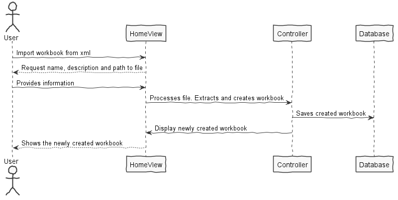

**Vitor Brito** (1161182) - Sprint 2 - IPC04.2
===============================

# 1. General Notes

*In this section you should register important notes regarding your work during the sprint. For instance, if you spend significant time helping a colleague or if you work in more than one feature increment.*

# 2. Requirements

*In this section you should describe the requirements for this sprint.*

IPC04.2 - It should be possible to import (i.e., upload) data from an XML file (this operation is the "inverse" of the previous one). Depending on the contents of the XML file, the data from the file can replace the contents of the active workbook, a spreadsheet or a range of a spreadsheet.

We can further specify this textual requirements as user stories.

Proposal:

US1 - As a user of the Application I want to be able to import a workbook from an xml file.

# 3. Analysis

*In this section you should describe the study/analysis/research you developed in order to design a solution.*

- Understand how to read and parse an XML file.

## 3.1 Analysis Diagrams

US1:

# 4. Design

*In this section you should present the design solution for the requirements of this sprint.*

## 4.1. Requirements Realization

## 4.2. Design Patterns and Best Practices

- Strategy Pattern  
- Repository  
- DTO  
- Service

# 5. Final Remarks 

In the end I couldn't get the functionality to work. Lack of expertise in conjunction with the added difficulty by the project structure and constant VCS problems contributed to delays that prevented me from being able to implement the use case.

# 6. Work Log

Commits:

- [#85 In Progress: Implementation on importing workbook](https://bitbucket.org/lei-isep/lapr4-18-2dc/commits/db991e6fdc4d626ccd84dad8e3e15bf9056ff760)
- [#85 Added implementation for Workbook import on controller. All ui for import xml](https://bitbucket.org/lei-isep/lapr4-18-2dc/commits/98db8bebf80bbd3eb86e9cc5914ff6757a2d283e)
