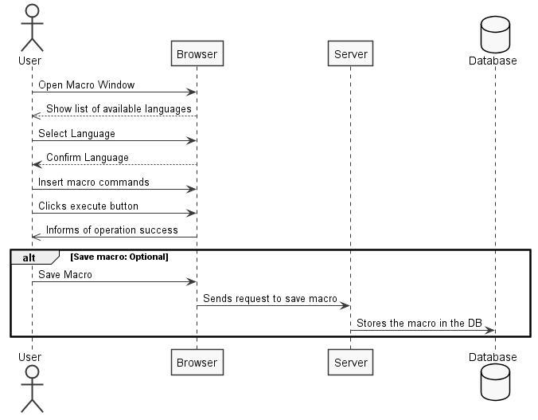
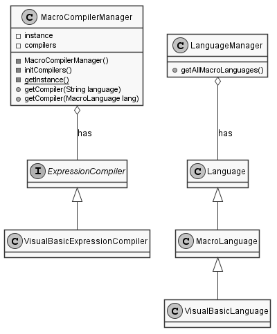
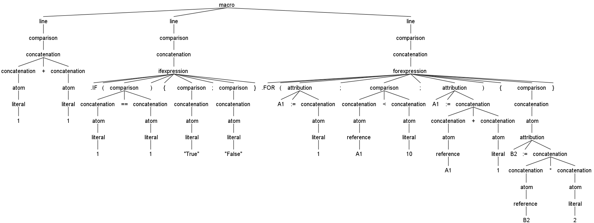
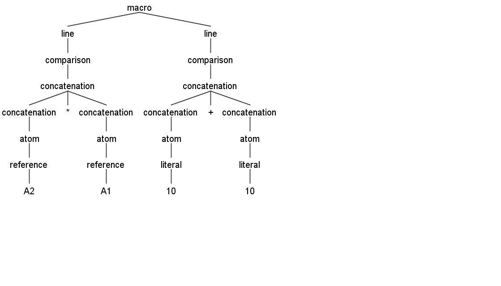
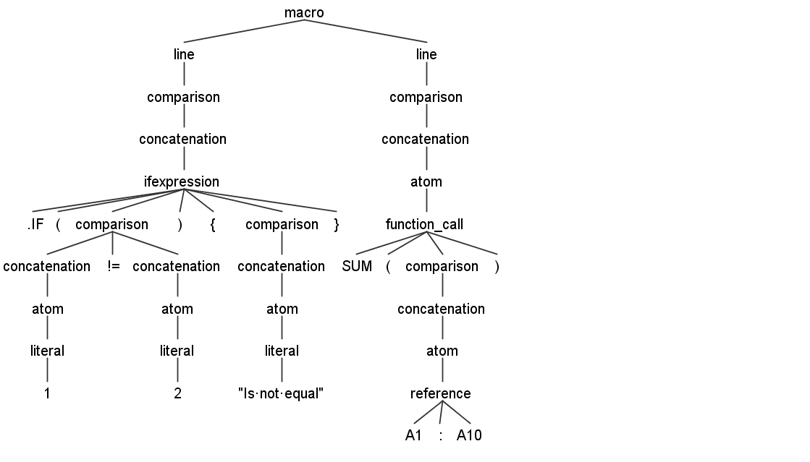

# *Vítor Brito* (1161182) - Sprint 3 - Lang08.1

# 1. General Notes

It must be noted that this is the second attempt at implementing this use case. First tried in the first sprint by [Mário Dias](docs/blue/1151708/sp1/README.md).

For the most part this documentation is the same as in the first sprint.

# 2. Requirements

Lang08.1 - Javascript Language 

The application should support a language inspired in the syntax of Javascript. This language is to be an alternative language to writing "Macros". This feature increment should have the same functionality as [Lang06.1](docs/blue/1090657/sp1/README.md) but with the adaptations required by the syntax of the language.

This language can do everything that the formulas language does but in multiple lines. The cell result is the last executed line.

# 3. Analysis

For this iteration, since it was a second attempt at this use case, the main goal was to try and solve the problem that prevented the full implementation of the use case.

For that I started by:
- Understanding where the code was located. Namely the grammar and due classes
- Finding the main problems
- Understand the linked parts of the solution

## 3.1 Project Structure

**Modules**. From the pom.xml file we can see that the application is composed of 5 modules:  
- **server**. It is the "server part" of the web application.  
- **shared**. It contains code that is shared between the client (i.e., web application) and the server.   
- **nsheets**. It is the web application (i.e., Client).  
- **util**. This is the same module as the one of EAPLI.  
- **framework**. This is the same module as the one of EAPLI.

The code related to this use case will be located in the shared module.

## 3.2. Analysis Diagrams

For this use case the sequence of actions taken is rather simple. After the user opens the macro window (right click on a cell), it has to choose one of the available languages, after confirming the language it can now insert new set of commands, afterwards he can press the button to execute a macro.

Note: This diagram only shows the successful operation.

### Macro Language Model

### Needed Expressions

# 4. Design

For the Javascript macro language, I first analyzed the provided language for the excel expressions. The macro language has to be able to process multiple lines, in the new language I made the necessary changes to support this change.  

###Interpret multiple lines:

    grammar javascript;
    macro: line+;
    line: comparison;

###Implement If Expression

    ifexpression :  IF LPAR comparison RPAR LCURLYBRACKETS comparison ( SEMI comparison ) ? RCURLYBRACKETS ;

###Implement For Expression

    forexpression : FOR LPAR attribution SEMI comparison SEMI attribution RPAR LCURLYBRACKETS comparison ( SEMI comparison)* RCURLYBRACKETS ;

A compiler is necessary to return an expression from a given command. For that the class JavascriptExpressionCompiler was created, its responsibility is to instantiate a parser and lexer. 

#####Code example:
        
        ANTLRInputStream input = new ANTLRInputStream(source);
        JavascriptLexer lexer = new JavascriptLexer(input);
        CommonTokenStream tokens = new CommonTokenStream(lexer);
        JavascriptParser parser = new JavascriptParser(tokens);
        JavascriptErrorListener javasError = new JavascriptErrorListener();
        parser.removeErrorListeners();
        parser.addErrorListener(javasError);
        ParseTree tree = parser.macro();
        if (parser.getNumberOfSyntaxErrors() > 0) {
            throw new FormulaCompilationException(javasError.getErrorMessage());
        }
        JavascriptEvalVisitor eval = new JavascriptEvalVisitor(cell, new JavascriptLanguage("javas",""));
        Expression result = eval.visit(tree);
        if (eval.getNumberOfErrors() > 0) {
            throw new FormulaCompilationException(eval.getErrorsMessage());
        }

A visitor is needed so it can disassemble any given grammar, for that the class JavascriptEvalVisitor was created.

#####Code example:

        @Override
        public Expression visitConcatenation(javascriptParser.ConcatenationContext ctx) {
            try {
                if (ctx.getChildCount() == 2) { // Convert unary operation
                    int operatorid = 0, operand = 1;  // Assume operator on the left
                    if (ctx.PERCENT() != null) { // Conclude that operator is on the right
                        operatorid = 1;
                        operand = 0;
                    }
                    return new UnaryOperation(
                            // Language.getInstance().getUnaryOperator(ctx.getChild(operatorid).getText()),
                            this.language.getUnaryOperator(ctx.getChild(operatorid).getText()),
                            visit(ctx.getChild(operand))
                    );
                } else if (ctx.getChildCount() == 3) {
                    BinaryOperator operator = this.language.getBinaryOperator(ctx.getChild(1).getText());
                    return new BinaryOperation(
                            visit(ctx.getChild(0)),
                            operator,
                            visit(ctx.getChild(2))
                    );
                }
            } catch (FormulaCompilationException ex) {
                addVisitError(ex.getMessage());
            }
            return visitChildren(ctx);
        }

## 4.1. Tests

There are three types of tests.
- Unit Tests, Antlr4 grammar tests and functional tests
- Unit Tests could not be implement to ensure language is working since workbook has dependencies on CellImpl, CellImpl has dependecies on Value.parseValue(), and this last one depends on GWT library.
So it's not possible to test languages directly with domain objects.

#####Test 1 - Parsing tree for the folowing macro:

    1+1
    .IF(1==1){"True";"False"}
    .FOR(A1:=1;A1<10;A1:=A1+1){B2:=B2*2}

#####Test 2 - Parsing tree for the folowing macro:

    A2*A1
    10 + 10

#####Test 3 - Parsing tree for the folowing macro:

    .IF(1!=2){"Is not equal"}
    SUM(A1:A10)

## 4.2. Requirements Realization

**The requirements for this use case are the following:**
* A class that saves Macro code and it's name;
* A grammar for the new language;
* MacroLanguageManager that knows all the languages;
* MacroCompilerManager that knows all the the compilers 
* Language specific Visitor;
* If Expression for the grammar;
* For Expression for the new grammar;
* Temporary variable expression;
* Expression of expressions {block}
* UI capable of choosing language and executing a given code
* UI capable of showing errors, cause there are not unit tests available

## 4.3. Classes

The major classes in this UC were the following:

- **JavascriptLanguage**
    - This class extends the class *MacroLanguage*, that makes this class a language capable of compiling any macro command supported by the Javascript grammar;

-  **LanguageManager**
    - This class is a singleton class (only instantiated once) and has all the available languages for this application and knows the difference between the normal and macro languages.

- **JavascriptExpressionCompiler**
    - Is responsible for the creation of the parser and lexer for creating a tree for a given grammar and returns an expression with all the logic translated from the macro code; 

- **JavascriptEvalVisitor**
    - This class is responsible for visiting the tree generated by the parser of the grammar;

- **MultipleExpressions**
    - Expressions that holds multiple expressions, so it can be evaluated after gathering all code logic from a block.

## 4.4. Design Patterns and Best Practises

The design patterns used are the following:
* Visitor
* Singleton
* Factory
* Strategy
* Command

Best practices used:
* Single Responsibility Principle
* Dependency Inversion Principle
* Open/Closed Principle
* High Cohesion
* Low Coupling

# 5. Implementation

## Grammar
    grammar Javascript;

    macro: line+;
    
    line: comparison;
    
    comparison
        : concatenation
            ( ( DOUBLEEQ | EQ | NEQ | GT | LT | LTEQ | GTEQ ) concatenation )? 	
        ;

    concatenation
            : ( MINUS )? atom                                       
            | concatenation PERCENT
            | <assoc=right> concatenation POWER concatenation
            | concatenation ( MULTI | DIV ) concatenation
            | concatenation ( PLUS | MINUS ) concatenation
            | ifexpression 
            | forexpression
            | concatenation AMP concatenation
            ;

    atom
        :	function_call
        |	reference
        |	literal
        |	LPAR comparison RPAR
        |	attribution
        ;

    attribution
        : CELL_REF ATTRIB concatenation
        ;

    function_call
        :	
        FUNCTION LPAR comparison RPAR  ( LCURLYBRACKETS ( comparison ( SEMI comparison )* )? RCURLYBRACKETS )? 
            
        ;

    ifexpression :  IF LPAR comparison RPAR LCURLYBRACKETS comparison ( SEMI comparison ) ? RCURLYBRACKETS ;

    forexpression : FOR LPAR attribution SEMI comparison SEMI attribution RPAR LCURLYBRACKETS comparison ( SEMI comparison)* RCURLYBRACKETS ;

    reference
        :	CELL_REF
            ( ( COLON ) CELL_REF )?
        ;

    literal
        :	NUMBER
        |	STRING
        ;
        
    fragment LETTER: ('a'..'z'|'A'..'Z') ;
    
    FUNCTION : 
        ( LETTER )+ 
        ;	
        
    CELL_REF
        :
            ( ABS )? LETTER ( LETTER )?
            ( ABS )? ( DIGIT )+
        ;

    /* String literals, i.e. anything inside the delimiters */
    STRING  : QUOT ('\\"' | ~'"')* QUOT
            ;

    QUOT: '"' 
        ;

    /* Numeric literals */
    NUMBER: ( DIGIT )+ ( COMMA ( DIGIT )+ )? ;

    fragment 
    DIGIT : '0'..'9' ;

    /* Comparison operators */
    EQ		: '=' ;
    DOUBLEEQ : '==' ;
    NEQ		: '!=' ;
    LTEQ	: '<=' ;
    GTEQ	: '>=' ;
    GT		: '>' ;
    LT		: '<' ;

    /* Text operators */
    AMP		: '&' ;

    /* Arithmetic operators */
    PLUS	: '+' ;
    MINUS	: '-' ;
    MULTI	: '*' ;
    DIV		: '/' ;
    POWER	: '^' ;
    PERCENT : '%' ;

    /* Reference operators */
    fragment ABS : '$' ;
    fragment EXCL:  '!'  ;
    COLON	: ':' ;
    ATTRIB : ':=' ;
    
    /* Miscellaneous operators */
    COMMA	: ',' ;
    SEMI	: ';' ;
    LPAR	: '(' ;
    RPAR	: ')' ; 
    LCURLYBRACKETS	: '{' ;
    RCURLYBRACKETS	: '}' ;

    /* Function Names */
    IF : '.IF' ;
    FOR : '.FOR' ;

    /* White-space (ignored) */
    WS: ( ' ' | '\r' | '\n' | '\t') -> skip;

    LINECOMMENT: DOUBLESLASH ~[\r\n]* -> skip;

    /* Comment */
    DOUBLESLASH: '//' ;

## JavascriptExpressionCompiler

    public JavascriptExpressionCompiler() {
        language = (MacroLanguage) LanguageManager.getInstance().getLanguage("javas");
    }

    @Override
    public char getStarter() {
        return FORMULA_STARTER;
    }

    @Override
    public Expression compile(Cell cell, String source) throws FormulaCompilationException {

        // Create the lexer and parser
        ANTLRInputStream input = new ANTLRInputStream(source);

        // create the buffer of the tokens between the lexer and parser
        javascriptLexer lexer = new javascriptLexer(input);
        CommonTokenStream tokens = new CommonTokenStream(lexer);

        javascriptParser parser = new javascriptParser(tokens);

        JavascriptErrorListener javasError = new JavascriptErrorListener();
        parser.removeErrorListeners();
        parser.addErrorListener(javasError);

        ParseTree tree = parser.macro();
        if (parser.getNumberOfSyntaxErrors() > 0) {
            throw new FormulaCompilationException(javasError.getErrorMessage());
        }

        // Visit the expression and returns it
        JavascriptEvalVisitor eval = new JavascriptEvalVisitor(cell, new JavascriptLanguage("javas",""));
        Expression result = eval.visit(tree);
        if (eval.getNumberOfErrors() > 0) {
            throw new FormulaCompilationException(eval.getErrorsMessage());
        }
        return result;
    }

    public static class JavascriptErrorListener extends BaseErrorListener {

        private StringBuilder buf;

        public String getErrorMessage() {
            return buf.toString();
        }

        @Override
        public void syntaxError(Recognizer<?, ?> recognizer, Object offendingSymbol, int line, int charPositionInLine,
                String msg, RecognitionException e) {
            List<String> stack = ((Parser) recognizer).getRuleInvocationStack();
            Collections.reverse(stack);

            buf = new StringBuilder();
            buf.append("line ").append(line).append(":").append(charPositionInLine).append(": ").append(msg);
        }
    }

    @Override
    public String compilerName() {
        return compilerName;
    }

## JavascriptLanguage
    
    public JavascriptLanguage(String name, String starter) {
        super(name, starter);
    }

    @Override
    protected void initFunctions() {
        functions.add(new Average());
        functions.add(new And());
        functions.add(new Count());
        functions.add(new Do());
        functions.add(new Factorial());
        functions.add(new False());
        functions.add(new If());
        functions.add(new Not());
        //functions.add(new NumericFunction());
        functions.add(new Or());
        functions.add(new Sum());
        functions.add(new True());
    }
    
    @Override
    protected void initBinaryOperators() {
        binaryOperators.add(new Adder());
        binaryOperators.add(new Concatenator());
        binaryOperators.add(new Divider());
        binaryOperators.add(new Equal());
        binaryOperators.add(new Exponentiator());
        binaryOperators.add(new GreaterThan());
        binaryOperators.add(new GreaterThanOrEqual());
        binaryOperators.add(new LessThan());
        binaryOperators.add(new LessThanOrEqual());
        binaryOperators.add(new Multiplier());
        binaryOperators.add(new NotEqual());
        binaryOperators.add(new RangeReference());
        binaryOperators.add(new Subtracter());
        binaryOperators.add(new Attribution());
    }

    @Override
    protected void initUnaryOperators() {
        // functions.add(new Average());
        unaryOperators.add(new Negator());
        unaryOperators.add(new Percent());
    }

    
     @Override
    public String toString() {
    	return "javas";
    }

## Code Organization
Code remains on the same structure as in the first sprint.

    lapr4___________
    │   │   │        │   ├───blue
    │   │   │        │   │   └───s1
    │   │   │        │   │       ├───lang
    │   │   │        │   │       │   ├───n1151708
    │   │   │        │   │       │   │   ├───formula
    │   │   │        │   │       │   │   │   └───lang
    │   │   │        │   │       │   │   │           JavascriptLanguage.java
    │   │   │        │   │       │   │   │
    │   │   │        │   │       │   │   └───javascript
    │   │   │        │   │       │   │       └───compiler
    │   │   │        │   │       │   │    JavascriptEvalVisitor.java
    │   │   │        │   │       │   │               JavascriptExpressionCompiler.java

# 6. Integration/Demonstration
    
    Not completed

# 7. Final Remarks

Even after a second iteration on this use case it was impossible to get it to work. 

Some Questions/Issues identified during the work in this increment:

1. I had a major problem debugging this application.

# 8. Work Log
