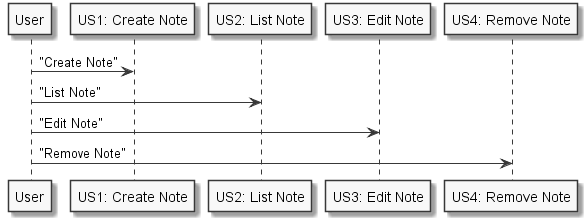
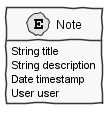
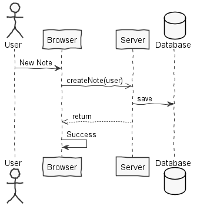
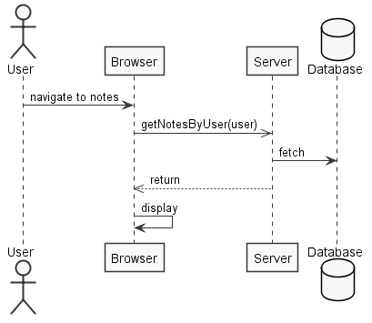
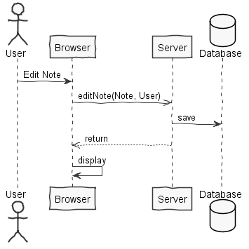
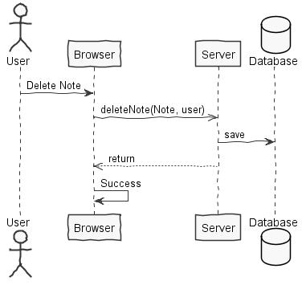
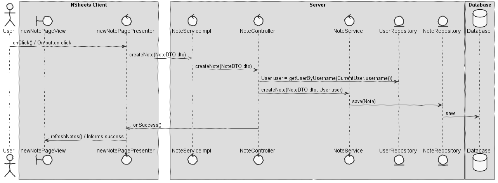
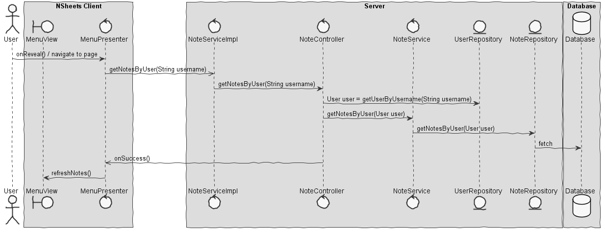
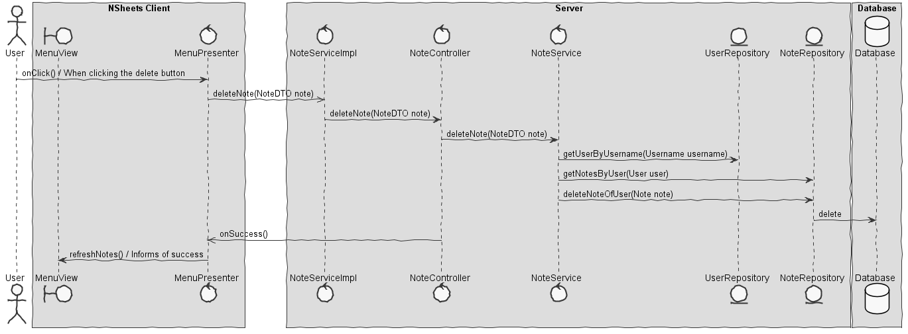

**Rúben Santos** (1161391) - Sprint 1 - Core07.1
===============================

# 1. General Notes

In this use case, I had to create, edit and delete User notes. Having spent some time learning the project set me back a little and having problems with some collegue's work that was input put my progress back a lot as the whole database was clamped and blocked. Many people had to deal with the same thing and had their progress stopped unfortunately. 

I came across problems with learning the project's base, things that didn't inject properly, errors caused by little knowledge of the foundation set my progress back a little thus making me waste a little more time. Even then, the only thing undone is the editting of a user note that can be implemented in the future easily and the history versioning...since there's no editting.

# 2. Requirements

Core07.1 - The notes should be global and accessible from anywhere in the page. The notes must have a timestamp associated with it after its' name and description. These should be deletable as well as addable.

Proposal:

US1 - As a User of the Application I want to be able to create, edit or delete notes when I am anywhere in the application.

We can further specify this textual requirements as user stories.

Proposal:

US1 - As a User of the Application I want to be able to create notes when I am anywhere in the application and save it for later review.

US2 - As a User of the Application I want to be able to list notes when I am anywhere in the application.

US3 - As a User of the Application I want to be able to edit notes when I am anywhere in the application and save it for later review

US4 - As a User of the Application I want to be able to delete notes when I am anywhere in the application and save it for later review

# 3. Analysis

*In this section you should describe the study/analysis/research you developed in order to design a solution.*

For this feature increment, since it is the first one to be developed in a new project I need to:  

- Understand how the application works and also understand the key aspects of GWT, since it is the main technology behind the application  

- Understand how the pages are implemented (for instance, how the UI gets the pages that are displayed to display them to the user)  

- Understand how to integrate a relational database into the project (Will be assuming JPA since it is studied in EAPLI)

- Understand how the Menu is implemented to add a new button for the notes.

- Understand how to interact with the user through the GWT design.

## 3.1 GWT and Project Structure

**Modules**. From the pom.xml file we can see that the application is composed of 5 modules:  
- **server**. It is the "server part" of the web application.  
- **shared**. It contains code that is shared between the client (i.e., web application) and the server.   
- **nsheets**. It is the web application (i.e., Client).  
- **util**. This is the same module as the one of EAPLI.  
- **framework**. This is the same module as the one of EAPLI.   
  
From [GWT Overview](http://www.gwtproject.org/overview.html): *"The GWT SDK contains the Java API libraries, compiler, and development server. It lets you write client-side applications in Java and deploy them as JavaScript."*

Therefore:
  - The project is totally developed in Java, event for the UI parts.
  - GWT uses a technique know as "transpilation" to translate Java code to Javascript. This is totally transparent to the user
  - A GWT application is comprised of "GWT modules" (see [GWT Tutorial](http://www.gwtproject.org/doc/latest/tutorial/create.html)). These GWT modules are described in .gwt.xml files.
   The nsheets project contains a .gwt.xml file named nsheets.gwt.xml (nsheets/src/main/resources/pt/isep/nsheets/nsheets.gwt.xml). One of the important contents of the file is the specification of the entry point of the application. However, since the application uses the [GWTP framework](http://dev.arcbees.com/gwtp/) the entry point is automatically provided (no need to specify it in the .gwt.xml file). In this case what is specified is the GIN client module pt.isep.nsheets.client.gin.ClientModule:
   
	    <extend-configuration-property name="gin.ginjector.modules"
                                   value="pt.isep.nsheets.client.gin.ClientModule"/>
                                   
   It is from this **ClientModule** that the application starts.
   Another important content of a .gwt.xml file is setting the paths for translatable code, .i.e., java code that should be translated to javascript. Usually the default source path is the client subpackage underneath where the .gwt.xml File is stored. In this case every code inside package pt.isep.nsheets.client and pt.isep.nsheets.shared will be translated to javascript. 
   
	<!-- Specify the paths for translatable code                    -->
    <source path='client'/>
    <source path='shared'/>
        
   The shared package is where shared code between server and client should reside. See [GWT - What to put in the shared folder?](https://stackoverflow.com/questions/5664601/gwt-what-to-put-in-the-shared-folder?utm_medium=organic&utm_source=google_rich_qa&utm_campaign=google_rich_qa) and also [using GWT RPC](http://www.gwtproject.org/doc/latest/tutorial/RPC.html).
   
   In this project the shared, server and client (i.e, nsheets) code are separated also in Maven modules (but they could all be in the same project/maven module). 
   
## 3.2 Application Startup and GWTP

As described before the entry point for the application is the class **pt.isep.nsheets.client.gin.ClientModule**.

GWTP follows the MVP (Model-View-Presenter) pattern. It uses [GIN dependency injection](http://dev.arcbees.com/gwtp/core/presenters/gin-bindings.html) to put together the parts of each MVP. How the GWTP structures the application and uses GIN to bind all the required elements is described in [GWTP Beginner's Tutorial](http://dev.arcbees.com/gwtp/tutorials/index.html).

We can see that **ClientModule** installs the base presenter of the application:

	    	install(new ApplicationModule());
	        
The **ApplicationModule** module install all the other modules of the application:

	    	install(new HomeModule());
		install(new MenuModule());
		install(new AboutModule());
		install(new WorkbookModule());   

Each module represents an MVP page in the application.

In this MVP pattern each presenter defines a specific interface that is use to communicate with the UI (i.e., the View). Therefore the presenter can be fully isolated from dependencies related to the UI. For instance, the View interface that is defined by the ApplicationPresenter only has one method:

	interface MyView extends View, HasUiHandlers<MenuUiHandlers> {
	}

In this specific case the only type that is "shared" between Presenter and View is the String.

The View class is where all the UI code should be implemented. In GWT it is possible to create UI elements programmatically (see [GWT Build the UI](http://www.gwtproject.org/doc/latest/tutorial/buildui.html)). The UI can also be described in .ui.xml files using [UIBinder](http://www.gwtproject.org/doc/latest/DevGuideUiBinder.html). The NSheets project is using [GWT Material Design](https://github.com/GwtMaterialDesign/gwt-material) and therefore all the UI widgets are from that library. 

In the case of the Menu module we can see that there is a MenuView.ui.xml. This file declares some widgets. The attribute ui:field can be used to specify an id that can be then used to bind that element to a class in the code. For instance, in MenuView.ui.xml:

	<m:MaterialPanel ui:field="panel">
		<m:MaterialLabel ui:field="title" text="NSheets" fontSize="2.3em"/>
		<m:MaterialLabel ui:field="description" text="A Sophisticated Web Spreadsheet Application." fontSize="1.1em"/>
	</m:MaterialPanel>

Também é importante realçar um exemplo do uso de tokens para a criação de um página enteira ainda no MenuView.ui.xml
	
	<m.html:ListItem waves="DEFAULT">
    	<m:MaterialLink targetHistoryToken="{tokens.getAbout}" iconPosition="LEFT" iconType="INFO_OUTLINE" text="About"/>
    </m.html:ListItem>

## 3.3 Server and RPC

Since the service is a servlet it must be declared in the **web.xml** file of the project (see file nsheets/src/main/webapp/WEB-INF/web.xml).

	<!-- Servlets for the notes -->
	<servlet>
		<servlet-name>noteServiceServiceServlet</servlet-name>
		<servlet-class>pt.isep.nsheets.server.services.noteServiceServiceImpl</servlet-class>
	</servlet>
	<servlet-mapping>
		<servlet-name>noteServiceServiceServlet</servlet-name>
		<!-- The first "part" of the url is the name of the GWT module as in "rename-to" in .gwt.xml -->
		<url-pattern>/nsheets/noteService</url-pattern>
	</servlet-mapping> 
	

## 3.4 Analysis Diagrams

The main idea for the "workflow" of this feature increment.

**Use Cases**

- **Use Cases**. Since these use cases have a one-to-one correspondence with the User Stories we do not add here more detailed use case descriptions. We find that these use cases are very simple and may eventually add more specification at a later stage if necessary.

**Domain Model (for this feature increment)**

- **Domain Model**. From the client requisites we pulled simply this class which will promote a NoteDTO later with the same information, except for one field, which is user, instead of being a User it's Username to keep information from leaking in case there are security flaws.

**System Sequence Diagrams**

**For US1**

**For US2**

**For US3**

**For US4**

# 4. Design

## 4.1. Tests

Regarding tests we try to follow an approach inspired by test driven development. However it is not realistic to apply it for all the application (for instance for the UI part). Therefore we focus on the domain classes and also on the services provided by the server.

**Domain classes**

For the Domain classes we will have a class that represents the entity **Note**. This entity will have attributes that are refered by the client, as follows:
	
	- title (string)
	- description (string)
	- timestamp (date)

And an extra field to associate the note to the user:

	- user (User)

**Test:** We should ensure all methods within the Note class are working and do not give wrong information. In this particular case titles like "" and descriptions like "" were allowed, simply because if the user was to insert "" into the title or description the UI wouldn't allow it, making it less one thing to have to test for, since nothing else uses Note.

	@Test
    public void testDefineNoteTitle() {
        System.out.println("defineNoteTitle");
        String title = "";
        User user = new User(new Username("test"),new Password("test"), new Email("test@test.com"), "Admin");
        Note instance = new Note("","", user);
        instance.defineNoteTitle(title);
        assertTrue((instance.toDTO()).getTitle().equals(""));
    }

    /**
     * Test of defineNoteDescription method, of class Note.
     */
    @Test
    public void testDefineNoteDescription() {
        System.out.println("defineNoteDescription");
        String description = "";
        User user = new User(new Username("test"),new Password("test"), new Email("test@test.com"), "Admin");
        Note instance = new Note("","", user);
        instance.defineNoteDescription(description);
        assertTrue((instance.toDTO()).getDescription().equals(""));
    }

    /**
     * Test of fromDTO method, of class Note.
     */
    @Test
    public void testFromDTO() {
        System.out.println("fromDTO");
        NoteDTO dto = new NoteDTO("", "",new Date(), "");
        User user = new User(new Username("test"),new Password("test"), new Email("test@test.com"), "Admin");
        Note expResult = new Note("","",user);
        Note result = Note.fromDTO(dto, user);
        assertEquals((expResult.toDTO()).getTitle(), (result.toDTO()).getTitle());
    }

    /**
     * Test of toDTO method, of class Note.
     */
    @Test
    public void testToDTO() {
        System.out.println("toDTO");
        
        User user = new User(new Username("test"),new Password("test"), new Email("test@test.com"), "Admin");

        Note instance = new Note("","",user);
        String expResult = "";
        NoteDTO result = instance.toDTO();
        assertEquals(expResult, (result).getTitle());
    }

**Services/Controllers**

As far as my knowledge goes, I don't know how to test the controllers and the database using JPA and the UI has no need for the tests...therefore this section is clean until I can learn how to do these.

**Test Coverage**  
- The actual coverage for domain classes: 61%
- The actual coverage for application(controller) classes: 100%
 
- TODO: Add tests for controllers and persistences. 

## 4.2. Requirements Realization

Following the guidelines for JPA from EAPLI we envision a scenario like the following for realizing the use cases for this feature increment.

Please note only three UCs will be displayed here because one of them wasn't implemented due to time.

**For US1**

Notes for all diagrams:  
- The diagram only depicts the less technical details of the scenario;  
- For clarity reasons details such as the PersistenceContext or the RepositoryFactory are not depicted in this diagram.   
- **NoteService** realizes the GWT RPC mechanism;  
- **NoteController** is the *use case controller*, which also applies for the others;
- **NoteServiceImpl** is to group together all the services related to NoteService. 

**For US2**

**For US3**

## 4.3. Classes

## 4.4. Design Patterns and Best Practices

By memory we apply/use: 

- Service Layer
- Repository  
- DTO  
- MVP  

**TODO:** Exemplify the realization of these patterns using class diagrams and/or SD with roles marked as stereotypes. 

# 5. Implementation

**Code Organization**  

We followed the recommended organization for packages:  

- Code should be added (when possible) inside packages that identify the group, sprint, functional area and author;
- For instance, we used **lapr4.red.s1.core.n1161391**

The code for this sprint:  
Project **server**    

- pt.isep.nsheets.server.**lapr4.red.s1.core.n1161391**.notes.application: contains the controllers  
- pt.isep.nsheets.server.**lapr4.red.s1.core.n1161391**.notes.domain: contains the domain classes  
- pt.isep.nsheets.server.**lapr4.red.s1.core.n1161391**.notes.persistence: contains the persistence/JPA clases 
- Created the non-existing class: **pt.isep.nsheets.server.NoteServiceImpl**

Project **shared**  
- Updated the classes: **pt.isep.nsheets.shared.services.NoteService** and **pt.isep.nsheets.shared.services.NoteServiceAsync**  

Project **NSheets** 
- Updated the classes: **pt.isep.nsheets.client.aaplication.Menu.MenuView** and **pt.isep.nsheets.client.aaplication.Menu.MenuPresenter**  

- Updated the file: **pt.isep.nsheets.client.aaplication.Menu.MenuView.ui.xml**

- Created the file:  **pt.isep.nsheets.client.aaplication.newNotePage.newNotePage.ui.xml**

- Created the classes: **pt.isep.nsheets.client.aaplication.newNotePage.newNotePageModule**,**pt.isep.nsheets.client.aaplication.newNotePage.newNotePageUiHandler**,
**pt.isep.nsheets.client.aaplication.newNotePage.newNotePageView** and **pt.isep.nsheets.client.aaplication.newNotePage.newNotePagePresenter**  

[Core07.1 - Added newNotePage](https://bitbucket.org/lei-isep/lapr4-18-2dc/commits/91c87b64b6c2969b2480bc5797f1016d8f65e15d)

# 6. Integration/Demonstration

# 7. Final Remarks 

*In this section present your views regarding alternatives, extra work and future work on the issue.*

Some Questions/Issues identified during the work in this feature increment:

1. Because two user stories are missing it'd be important to finish the use case fully;
2. Besides my own work I tried to help as much as I could both myself and my collegues.
3. It's also relevant to note the issue that the client not being able to call the controller brought such a problem to the use case, the errors took long to fix.

# 8. Work Log

Commits:

[Core07.1 - Changed Menu View to have a Note button](https://bitbucket.org/lei-isep/lapr4-18-2dc/commits/7826c1fd9284e9dcd91df751be0e8a1f1d9bc380)

[Core07.1 - Added newNotePage](https://bitbucket.org/lei-isep/lapr4-18-2dc/commits/91c87b64b6c2969b2480bc5797f1016d8f65e15d)

[Core07.1 - Note Domain and JPA Persistence](https://bitbucket.org/lei-isep/lapr4-18-2dc/commits/43b414874f1f8e24fc108ced30898cdce8c91ffb)

[Core07.1 - Fixing Menu Division](https://bitbucket.org/lei-isep/lapr4-18-2dc/commits/08d17090514281a34eed7962424929f4849fc8dd)

[Core07.1 - Listing notes and adding notes - Persistence, DTO, Service, Controller](https://bitbucket.org/lei-isep/lapr4-18-2dc/commits/72c83c6f1fd6cb5ffd2131260a70f129edeafcf1)

[Core07.1 - Hotfixing Error](https://bitbucket.org/lei-isep/lapr4-18-2dc/commits/118752ffb9a10cfd11615f249ca85778891fdb6b)

[Core07.1 - Deleting a note - UI, Design, Services, Controller and Persistance](https://bitbucket.org/lei-isep/lapr4-18-2dc/commits/7efe54a6a7f81ff9eb54844d195f7596e6c0c08d)

