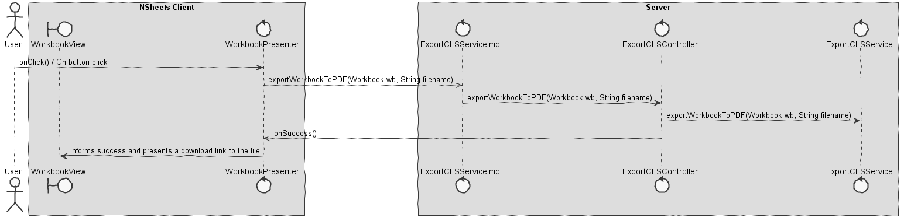

**Rúben Santos** (1161391) - Sprint 2 - Core05.2
===============================

# 1. General Notes

In this use case, I had to export a CLS file. I spent a lot of time reviewing the application and the cleansheets application, after some conversation with people of better knowledge than me it was seen that it'd be impossible for the web application to produce a file able to import a file in the cleansheets application. It was implemented regardless of this however it was seen to be difficult to get a link to the UI for the user to download, since it gave an error. Without time to fix this error the use case was left as is.

# 2. Requirements

Core05.2 - The use case must export a CLS file that should be importable in the cleansheets application

Proposal:

US1 - As a User of the Application I want to be able to export a CLS file with the information of the current workbook.

# 3. Analysis

For this feature increment, since it is the first one to be developed in a new project I need to:  

- Understand how the application works and also understand the key aspects of GWT, since it is the main technology behind the application  

- Understand how the pages are implemented (for instance, how the UI gets the pages that are displayed to display them to the user)  

- Understand how to integrate a generated link to a file to the user.

- Understand how the WorkbookView is implemented to add a new button for the export.

- Understand how to interact with the user through the GWT design.

## 3.1 GWT and Project Structure

**Modules**. From the pom.xml file we can see that the application is composed of 5 modules:  
- **server**. It is the "server part" of the web application.  
- **shared**. It contains code that is shared between the client (i.e., web application) and the server.   
- **nsheets**. It is the web application (i.e., Client).  
- **util**. This is the same module as the one of EAPLI.  
- **framework**. This is the same module as the one of EAPLI.   
  
From [GWT Overview](http://www.gwtproject.org/overview.html): *"The GWT SDK contains the Java API libraries, compiler, and development server. It lets you write client-side applications in Java and deploy them as JavaScript."*

Therefore:
  - The project is totally developed in Java, event for the UI parts.
  - GWT uses a technique know as "transpilation" to translate Java code to Javascript. This is totally transparent to the user
  - A GWT application is comprised of "GWT modules" (see [GWT Tutorial](http://www.gwtproject.org/doc/latest/tutorial/create.html)). These GWT modules are described in .gwt.xml files.
   The nsheets project contains a .gwt.xml file named nsheets.gwt.xml (nsheets/src/main/resources/pt/isep/nsheets/nsheets.gwt.xml). One of the important contents of the file is the specification of the entry point of the application. However, since the application uses the [GWTP framework](http://dev.arcbees.com/gwtp/) the entry point is automatically provided (no need to specify it in the .gwt.xml file). In this case what is specified is the GIN client module pt.isep.nsheets.client.gin.ClientModule:
   
	    <extend-configuration-property name="gin.ginjector.modules"
                                   value="pt.isep.nsheets.client.gin.ClientModule"/>
                                   
   It is from this **ClientModule** that the application starts.
   Another important content of a .gwt.xml file is setting the paths for translatable code, .i.e., java code that should be translated to javascript. Usually the default source path is the client subpackage underneath where the .gwt.xml File is stored. In this case every code inside package pt.isep.nsheets.client and pt.isep.nsheets.shared will be translated to javascript. 
   
	<!-- Specify the paths for translatable code                    -->
    <source path='client'/>
    <source path='shared'/>
        
   The shared package is where shared code between server and client should reside. See [GWT - What to put in the shared folder?](https://stackoverflow.com/questions/5664601/gwt-what-to-put-in-the-shared-folder?utm_medium=organic&utm_source=google_rich_qa&utm_campaign=google_rich_qa) and also [using GWT RPC](http://www.gwtproject.org/doc/latest/tutorial/RPC.html).
   
   In this project the shared, server and client (i.e, nsheets) code are separated also in Maven modules (but they could all be in the same project/maven module). 
   
## 3.2 Application Startup and GWTP

As described before the entry point for the application is the class **pt.isep.nsheets.client.gin.ClientModule**.

GWTP follows the MVP (Model-View-Presenter) pattern. It uses [GIN dependency injection](http://dev.arcbees.com/gwtp/core/presenters/gin-bindings.html) to put together the parts of each MVP. How the GWTP structures the application and uses GIN to bind all the required elements is described in [GWTP Beginner's Tutorial](http://dev.arcbees.com/gwtp/tutorials/index.html).

We can see that **ClientModule** installs the base presenter of the application:

	    	install(new ApplicationModule());
	        
The **ApplicationModule** module install all the other modules of the application:

	    	install(new HomeModule());
		install(new MenuModule());
		install(new AboutModule());
		install(new WorkbookModule());   

Each module represents an MVP page in the application.

In this MVP pattern each presenter defines a specific interface that is use to communicate with the UI (i.e., the View). Therefore the presenter can be fully isolated from dependencies related to the UI. For instance, the View interface that is defined by the ApplicationPresenter only has one method:

	interface MyView extends View, HasUiHandlers<MenuUiHandlers> {
	}

In this specific case the only type that is "shared" between Presenter and View is the String.

The View class is where all the UI code should be implemented. In GWT it is possible to create UI elements programmatically (see [GWT Build the UI](http://www.gwtproject.org/doc/latest/tutorial/buildui.html)). The UI can also be described in .ui.xml files using [UIBinder](http://www.gwtproject.org/doc/latest/DevGuideUiBinder.html). The NSheets project is using [GWT Material Design](https://github.com/GwtMaterialDesign/gwt-material) and therefore all the UI widgets are from that library. 

In the case of the Menu module we can see that there is a MenuView.ui.xml. This file declares some widgets. The attribute ui:field can be used to specify an id that can be then used to bind that element to a class in the code. For instance, in MenuView.ui.xml:

	<m:MaterialPanel ui:field="panel">
		<m:MaterialLabel ui:field="title" text="NSheets" fontSize="2.3em"/>
		<m:MaterialLabel ui:field="description" text="A Sophisticated Web Spreadsheet Application." fontSize="1.1em"/>
	</m:MaterialPanel>

Também é importante realçar um exemplo do uso de tokens para a criação de um página enteira ainda no MenuView.ui.xml
	
	<m.html:ListItem waves="DEFAULT">
    	<m:MaterialLink targetHistoryToken="{tokens.getAbout}" iconPosition="LEFT" iconType="INFO_OUTLINE" text="About"/>
    </m.html:ListItem>

## 3.3 Server and RPC

Since the service is a servlet it must be declared in the **web.xml** file of the project (see file nsheets/src/main/webapp/WEB-INF/web.xml).

	<!-- Servlets for the notes -->
	<servlet>
		<servlet-name>noteServiceServiceServlet</servlet-name>
		<servlet-class>pt.isep.nsheets.server.services.noteServiceServiceImpl</servlet-class>
	</servlet>
	<servlet-mapping>
		<servlet-name>noteServiceServiceServlet</servlet-name>
		<!-- The first "part" of the url is the name of the GWT module as in "rename-to" in .gwt.xml -->
		<url-pattern>/nsheets/noteService</url-pattern>
	</servlet-mapping> 
	

## 3.4 Analysis Diagrams

The main idea for the "workflow" of this feature increment.

**Use Cases**

- **Use Cases**. Since these use cases have a one-to-one correspondence with the User Stories we do not add here more detailed use case descriptions. We find that these use cases are very simple and may eventually add more specification at a later stage if necessary.

**Domain Model (for this feature increment)**

All classes were already implemented by another use case leaving nothing to be added to the domain.

**System Sequence Diagrams**

# 4. Design

## 4.1. Requirements Realization

Notes for all diagrams:  
- The diagram only depicts the less technical details of the scenario;  
- For clarity reasons details such as the PersistenceContext or the RepositoryFactory are not depicted in this diagram.   
- **ExportCLSService** realizes the GWT RPC mechanism;  
- **ExportCLSController** is the *use case controller*, which also applies for the others;
- **ExportCLSServiceImpl** is to group together all the services related to ExportCLSService. 

## 4.2. Design Patterns and Best Practices

By memory we apply/use: 

- Service Layer
- DTO  
- MVP  

**TODO:** Exemplify the realization of these patterns using class diagrams and/or SD with roles marked as stereotypes. 

# 5. Final Remarks 

Some Questions/Issues identified during the work in this feature increment:

1. It'd be important to actually give the PDF file to the user, it'd also be nice to find a potencial way to get the file to import in the cleansheets application;
2. Besides my own work I tried to help as much as I could both myself and my collegues.
3. It's also relevant to note the issue that the client not being able to call the controller brought such a problem to the use case, the errors took long to fix.

# 8. Work Log

Commits:

[Core05.2 - Export PDF UI, Shared and Server - Services, Button and Export](https://bitbucket.org/lei-isep/lapr4-18-2dc/commits/7826c1fd9284e9dcd91df751be0e8a1f1d9bc380)

