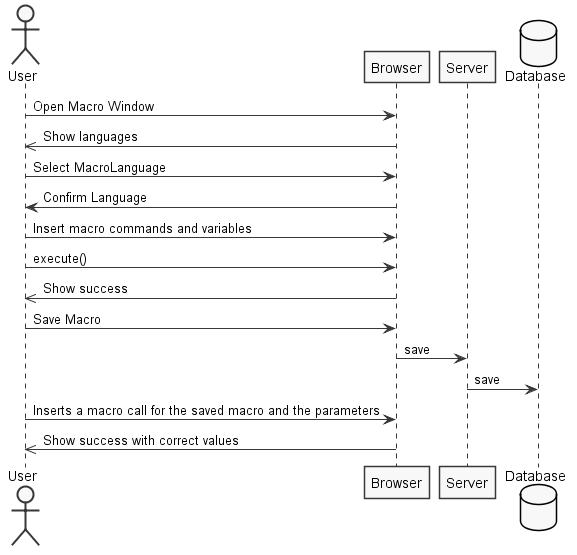
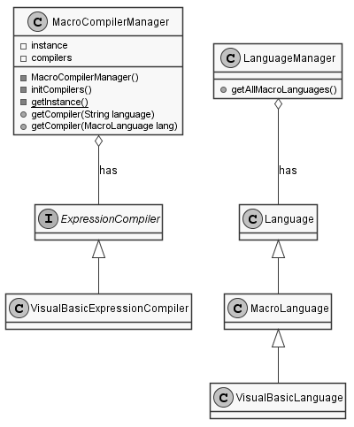
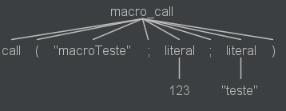

**Rúben Santos** (1161391) - Sprint 3 - Lang07.3
===============================
# 1. General Notes

My use case was to add parameters to the already calling functions without parameters in the visual basic language. This was kept as a standard as best as possible, however due to the lack of temporary variables, one had to do a workaround that is not at all viable and should be reimplemented as soon as the temporary variables are put in place.

My uc is dependant on:
- Temporary Variables
- UC Lang 07.1 and 07.2

# 2. Requirements

Lang07.3 - Visual Basic with Methods with parameters
This feature increment should have the same functionality as Lang06.3 but with the adaptations required by the syntax of the language.


## Proposal
UC 1 - As an end user i want to be able to declare variables and parameters to add onto my personal functions.


# 3. Analysis

For this feature, since it is the first one to developed I need to:

- Understand how the application works and also understand the key aspects of GWT, since it is the main technology behind the application  

- Learn the syntax for the formulas language

- Review Language Parsing and Grammar usage in ANTLRv4

- Skim through the book Pragmatic The Definitive ANTLR 4 Reference Jan 2013 so i understand better ANTLRv4

- Study Visual Basic syntax so i can implement and adapt to the macros use case

- Implement a grammar capable of multi line

- Follow updates on Formulas language and try to implement it

Other non direct UC related things

- Need to implement a Class that extends Lanaguge called **_MacroLanguage_**

# 3.1 Project Structure
**Modules**. From the pom.xml file we can see that the application is composed of 5 modules:  
- **server**. It is the "server part" of the web application.  
- **shared**. It contains code that is shared between the client (i.e., web application) and the server.   
- **nsheets**. It is the web application (i.e., Client).  
- **util**. This is the same module as the one of EAPLI.  
- **framework**. This is the same module as the one of EAPLI.

My code will reside in the shared folder since is shared between server and client.
## 3.2. Analysis Diagrams
**Use Cases**

This use case description is very simple, there is no need to explain more than the image.




For this feature increment we found ourselves needing the language manager to differenciate MacroLanguages
We needed also a manager for its associated compilers
And we needed way to interpret for and if expressions, and another way to evaluate multiple expressions not at visitor evaluation, but post macro code evalution.

Macro Language Model



# 4. Design

For the Visual Basic macro language i started with analyzing the formulas syntax and adapting it so it could do the following
* Interpret macro calls with parameters

I need to update an ANTLR4 grammar called VisualBasic.g4 to implement this.


## 4.1. Tests

There are three types of tests.
Unit Tests, Antlr4 grammar tests and functional tests
Unit Tests could not be implement to ensure language is working since workbook has dependencies on Cell, which is using CellImpl and CellImpl has dependecies on Value.parseValue(), and this last one depends on GWT library.
So it's not possible to test languages directly with domain objects.

The Antlr4 grammar tests are the following


The functional tests are only available during implementation through trial and error.

## 4.2. Requirements Realization

The requirements for this realization are the following:

* Need a grammar for interpretation.
* Need a temporary variable expression.
* Need an UI capable of choosing language and executing a given code.
* Need an UI capable of showing errors, cause there are not unit tests available.

## 4.3. Classes

- Macro
    - This class knows the macro name and stores macro code as a string.
    
- MacroCall
    - This class handles all commands and variables needed for a function call to succeed.
    
- VisualBasicLanguage
    - This class extends MacroLanguage, that makes this class a language capable of compile any macro command supported by the this grammar;

- LanguageManager
    - This class is a singleton class (only instantiated once) and has all the available languages for this application.
    And knows the difference between normal Languages and MacroLanguages.

- VisualBasicExpressionCompiler
    - Is responsible for the creation of the parser and lexer for creating a tree for a given grammar and returning and expression with all the logic translated from the macro code. 

- VisualBasicEvalVisitor
    - This class is responsible for visiting the tree generated by the parser of the grammar and create needed expressions on it's navigation.


## 4.4. Design Patterns and Best Practices

The design patterns used are the following:
* Visitor
* Singleton
* Factory
* Strategy
* Command

Best practices used:
* Single Responsability Principle
* Dependency Inversion Principle
* Open/Closed Principle

These practices ensure high cohesion and low coupling.

# 5. Implementation

The following code are extracts examples.

## Grammar

Instead of ignoring white space, we given an option to the lexer so simply hides it from parsing, making life easier.
```
macro_call:
    MACRO_START LPAR (STRING) (SEMI literal)* RPAR;
```

**Code Organization**
My code resides in shared project
# 6. Integration/Demonstration


# 7. Final Remarks

Conclusion is: We could not attain objectives,Implementation is 2/4 done.

The parameters should allow for expressions to be written.

I could not implement : temporary variables.
Testing method was not optimal, since we cannot use unit tests to test domain objects and language visiting.
Only grammar tests and functional tests are available, and since it's a big project, doing minor tweaking and compiling the project again takes a huge time.

The biggest problems were:
* Dealing with visitors, since it's not a easy pattern at first.
* Debugging cross client language with IntelliJ, with multiple breakpoints. It's not as direct debugging as native Java language.
* Compile times
* Big project problems with multiple commits failing.
* Merging problems.

# 8. Work Log

Commits:

[Added a way to add parameters without temporary variables making the use case possible.](https://bitbucket.org/lei-isep/lapr4-18-2dc/commits/deaf6395a9aa17aadb22cbb751f2ab4f92a54aae)